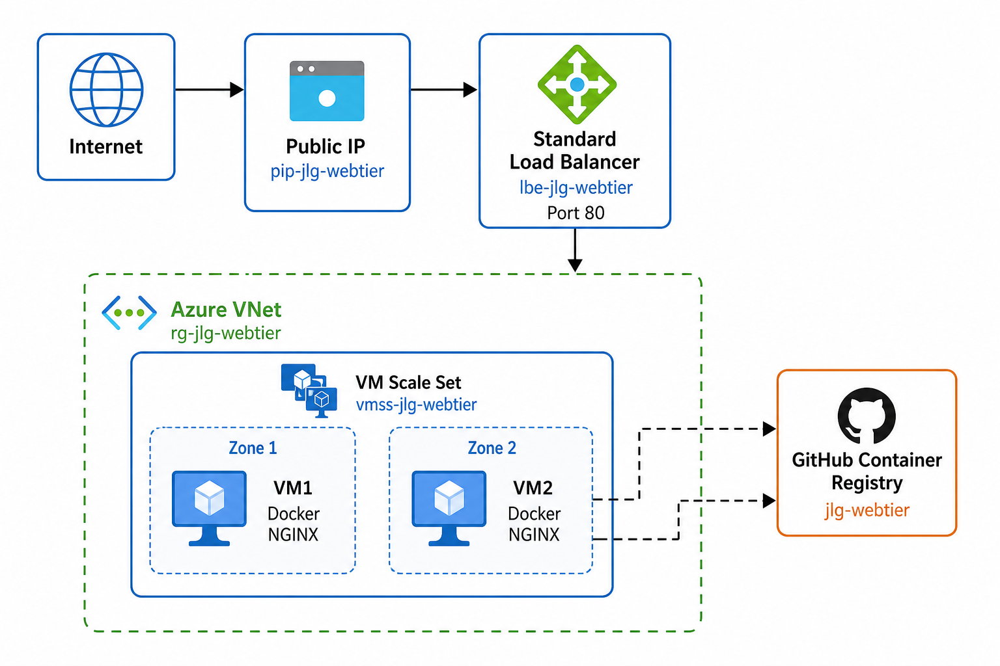

# jlg-auto-healing-webtier

Auto-healing web tier on **Azure** using Terraform and Docker. Two VMSS instances sit behind a Standard Load Balancer with N+1 capacity and automatic instance replacement.

**Repository:** https://github.com/prvnmali2017/jlg-auto-healing-webtier

## Azure

This solution uses Azure because Linux VM Scale Sets (VMSS) with a Standard Load Balancer provide native self-healing and N+1 capacity behind one public entry point. VMSS replaces terminated instances automatically, and cloud-init pulls a containerised NGINX page from GitHub Container Registry on each new VM. The stack is deployed in `australiaeast`.

## Architecture



Source: [docs/architecture.svg](docs/architecture.svg)

```
Internet → Public IP → Standard LB (HTTP :80)
                              ↓
                    VMSS (2 instances, zones 1 & 2)
                    cloud-init → docker pull → NGINX :80
                              ↑
                           GHCR (public image)
```

## Prerequisites

- [Azure CLI](https://learn.microsoft.com/en-us/cli/azure/install-azure-cli)
- [Terraform](https://developer.hashicorp.com/terraform/install) >= 1.5
- [Docker](https://docs.docker.com/get-docker/) with buildx (for multi-platform builds)

## Authenticate Terraform to Azure

```bash
az login
az account set --subscription "<subscription_id_or_name>"
```

Optional service principal:

```bash
az ad sp create-for-rbac --role="Contributor" --scopes="/subscriptions/<SUBSCRIPTION_ID>"
export ARM_CLIENT_ID="<APPID>"
export ARM_CLIENT_SECRET="<PASSWORD>"
export ARM_SUBSCRIPTION_ID="<SUBSCRIPTION_ID>"
export ARM_TENANT_ID="<TENANT>"
```

## Container image

Build for **linux/amd64** (required — Azure VMs are amd64; Mac builds are arm64 by default):

```bash
docker buildx build \
  --platform linux/amd64 \
  -t ghcr.io/prvnmali2017/jlg-webtier:latest \
  --push \
  .
```

Login and push (if not using `--push` above):

```bash
echo $GHCR_TOKEN | docker login ghcr.io -u prvnmali2017 --password-stdin
docker push ghcr.io/prvnmali2017/jlg-webtier:latest
```

**Important:**
- Set the GHCR package visibility to **Public** (Packages → `jlg-webtier` → Package settings)
- Verify: `docker buildx imagetools inspect ghcr.io/prvnmali2017/jlg-webtier:latest` shows `linux/amd64`

Test locally:

```bash
docker run --rm -p 8080:80 ghcr.io/prvnmali2017/jlg-webtier:latest
```

## Terraform

```bash
cd terraform
terraform init
terraform validate
terraform plan -var-file=environments/dev.tfvars -out=tfplan
terraform apply tfplan   # optional — reviewers evaluate plan output only
```

Run `terraform plan` again after apply — expect **0 to add, 0 to change, 0 to destroy**.

### Outputs

```bash
terraform output
```

| Output | Description |
|--------|-------------|
| `load_balancer_public_ip` | Public IP to reach the web tier |
| `load_balancer_fqdn` | DNS name (`*.cloudapp.azure.com`) |
| `vmss_id` | VM scale set resource ID |
| `resource_group_name` | Azure resource group |
| `web_url` | `http://<public-ip>` |

## Testing

### Web tier

```bash
curl -I http://$(terraform output -raw load_balancer_public_ip)
```

Expect **HTTP 200** and the Johns Lyng Group welcome page.

### Auto-healing

1. Confirm the site is up (`curl` above)
2. Azure Portal → `vmss-jlg-webtier` → **Instances** → delete one instance
3. Wait 2–5 minutes for VMSS to replace it and cloud-init to start Docker
4. `curl` again — site should still respond

### Debug on a VM

```bash
az vmss run-command invoke \
  -g rg-jlg-webtier -n vmss-jlg-webtier --instance-id 0 \
  --command-id RunShellScript \
  --scripts "cloud-init status; docker ps; curl -I http://localhost:80"
```

## CI pipeline

GitHub Actions runs on push/PR to `terraform/`:

- `terraform fmt -check`
- `terraform init -backend=false`
- `terraform validate`
- `terraform plan` (requires Azure secrets in the repository)

Add these **repository secrets** to enable plan in CI:

| Secret | Description |
|--------|-------------|
| `ARM_CLIENT_ID` | Service principal app ID |
| `ARM_CLIENT_SECRET` | Service principal secret |
| `ARM_SUBSCRIPTION_ID` | Azure subscription ID |
| `ARM_TENANT_ID` | Azure tenant ID |

Workflow: [.github/workflows/terraform-ci.yml](.github/workflows/terraform-ci.yml)

## Assumptions

- Region: `australiaeast`
- 2× `Standard_B2ls_v2` VMSS instances across availability zones 1 and 2
- Standard Load Balancer with HTTP health probe on port 80
- Public GHCR image (no Azure Container Registry)
- VMSS instances have no public IP — inbound traffic via load balancer only
- Infrastructure apply is optional for review; tear down after validation

## Estimated monthly cost

| Resource | Estimated cost (AUD/month) |
|----------|----------------------------|
| 2× Standard_B2ls_v2 VMs | ~AUD 12–16 |
| Public IP (static, Standard) | ~AUD 5 |
| Standard Load Balancer | ~AUD 25–30 |
| **Total (24/7)** | **~AUD 42–51** |

The assignment target is ≤ AUD 20 if fully deployed. The Standard Load Balancer is the main cost driver. Reviewers evaluate `terraform plan` output; destroy resources after demo to avoid ongoing charges.

References:
- [Azure VM pricing](https://azure.microsoft.com/en-au/pricing/details/virtual-machines/linux/)
- [Azure Load Balancer pricing](https://azure.microsoft.com/en-au/pricing/details/load-balancer/)

## Project structure

```
jlg-auto-healing-webtier/
├── .github/workflows/terraform-ci.yml
├── Dockerfile
├── diagram.png
├── docs/architecture.svg
├── README.md
└── terraform/
    ├── main.tf
    ├── outputs.tf
    ├── variables.tf
    ├── versions.tf
    ├── cloud-init.tpl
    ├── environments/dev.tfvars
    └── modules/
        ├── network/
        ├── load_balancer/
        └── vmss/
```

## Tear down

```bash
cd terraform
terraform destroy -var-file=environments/dev.tfvars
```
