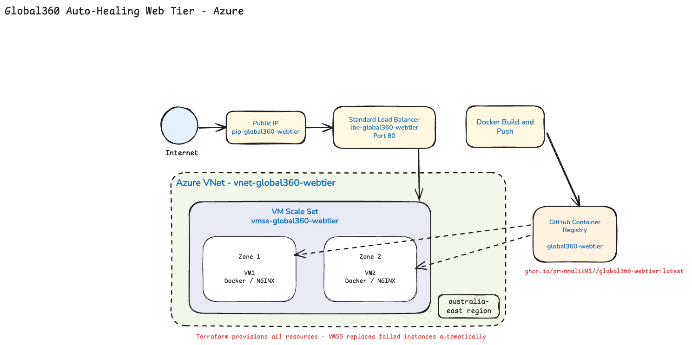

# global360-auto-healing-webtier

Auto-healing web tier on Azure — two VM Scale Set instances(VMSS) behind a load balancer, serving a containerised NGINX page. The goal is to lose any single VM without downtime: delete one instance and VMSS replaces it while the other keeps serving traffic.

**Repository:** [https://github.com/prvnmali2017/jlg-auto-healing-webtier](https://github.com/prvnmali2017/jlg-auto-healing-webtier)

## How to run

**Prerequisites:** [Azure CLI](https://learn.microsoft.com/en-us/cli/azure/install-azure-cli), [Terraform](https://developer.hashicorp.com/terraform/install) ≥ 1.5

```bash
az login
az account set --subscription "<subscription_id_or_name>"
```

**Plan** (required for review):

```bash
git clone https://github.com/prvnmali2017/jlg-auto-healing-webtier.git
cd jlg-auto-healing-webtier
cd terraform
terraform init
terraform validate
terraform plan -var-file=environments/dev.tfvars
```

**Apply** (optional):

```bash
terraform plan -var-file=environments/dev.tfvars -out=tfplan
terraform apply tfplan
```

Run `terraform plan` again after apply — expect **0 to add, 0 to change, 0 to destroy**.

**Outputs:** `load_balancer_public_ip`, `web_url`, `load_balancer_fqdn`, `vmss_id`, `resource_group_name`

**Tear down** (when finished):

```bash
terraform destroy -var-file=environments/dev.tfvars
```

## Why Azure?

I work extensively across both Azure and AWS as a senior engineer in my previous roles, but chose Azure here because of:

- **Organisational fit** — JLG runs on Microsoft App Stack which I reviewed from Job requirements (.NET, Windows Server, AD, M365). Azure fits that stack closely with Microsoft Ecosystem. 
- **Technical fit** — VM Scale Sets and a Standard Load Balancer deliver self-healing and N+1. Terraform provisions everything; cloud-init pulls a Docker image on first boot.
- **Operational fit** — Deployed to `australiaeast`. VMs have no public IPs — all inbound traffic goes through the load balancer.

## Architecture



Internet traffic hits a public IP and Standard Load Balancer on port 80, then spreads across two VMSS instances in zones 1 and 2. Each VM bootstraps via cloud-init — installs Docker, pulls the image from GHCR, and starts NGINX.

## Infrastructure as Code

Terraform code lives in `terraform/` with three modules:


| Module          | Purpose                                                |
| --------------- | ------------------------------------------------------ |
| `network`       | Resource group, VNet, subnet, NSG                      |
| `load_balancer` | Standard LB, public IP, HTTP health probe on port 80   |
| `vmss`          | Linux VM Scale Set (2 instances), cloud-init bootstrap |


**Naming** Conventions — resources follow `{type}-global360-webtier` (e.g. `rg-global360-webtier`, `vmss-global360-webtier`, `pip-global360-webtier`).

**Variables** — configurable via `variables.tf` with environment values in `environments/dev.tfvars`.

**Tags** — applied consistently across resources:

```hcl
environment = "dev"
project     = "global360-webtier"
managed_by  = "terraform"
region      = "australiaeast"
```

## Container image


| Item                  | Location                                                                                     |
| --------------------- | -------------------------------------------------------------------------------------------- |
| Dockerfile            | `[Dockerfile](Dockerfile)`                                                                   |
| Public registry image | `ghcr.io/prvnmali2017/global360-webtier:latest` (linux/amd64) on GHCR                        |
| cloud-init bootstrap  | `[terraform/cloud-init.tpl](terraform/cloud-init.tpl)` — pulls and runs the image on each VM |


The image is already built and published. and we no need to build locally again.


## Assumptions

- Region: `australiaeast`
- Two `Standard_B2ls_v2` VMSS instances across availability zones 1 and 2
- Standard Load Balancer with HTTP health probe on port 80
- NSG allows inbound HTTP (80) and HTTPS (443) to the VNet, plus Azure Load Balancer traffic
- Public GHCR image 
- VMs have no public IP; inbound traffic enters only via the load balancer
- SSH key generated by Terraform (`tls_private_key`) for VMSS admin access

## Estimated monthly cost


| Resource                | ~AUD/month |
| ----------------------- | ---------- |
| 2× Standard_B2ls_v2 VMs | 12–16      |
| Standard Public IP      | 5          |
| Standard Load Balancer  | 25–30      |
| **Total (24/7)**        | **42–51**  |


The question was to to use targets ≤ AUD 20/month if fully deployed. That isn't achievable with this architecture — the Standard Load Balancer alone exceeds the budget.Unfortunately Azure retired Basic Load Balancer in September 2025, so Standard is the only viable option for a new deployment. 

## CI pipeline

GitHub Actions runs on push/PR to `terraform/`:

- `terraform fmt -check`
- `terraform validate`
- `terraform plan` (requires `ARM_CLIENT_ID`, `ARM_CLIENT_SECRET`, `ARM_SUBSCRIPTION_ID`, `ARM_TENANT_ID` repository secrets)

Workflow: `[.github/workflows/terraform-ci.yml](.github/workflows/terraform-ci.yml)`

## Testing auto-healing

Only relevant if we applied the stack.

```bash
curl -I http://$(terraform output -raw load_balancer_public_ip)
```

Delete one instance in the portal (`vmss-global360-webtier` → Instances), wait 2–5 minutes, then curl again — the site should still respond.

## Commit history

Work was committed incrementally so the process is easy to follow on GitHub: project scaffold → Dockerfile and GHCR image → Terraform modules (network, load balancer, VMSS) → CI workflow → documentation and diagram.

## Project layout

```
├── .github/workflows/terraform-ci.yml
├── Dockerfile
├── docs/architecture.png
└── terraform/
    ├── main.tf, variables.tf, outputs.tf, versions.tf
    ├── cloud-init.tpl
    ├── environments/dev.tfvars
    └── modules/ (network, load_balancer, vmss)
```

